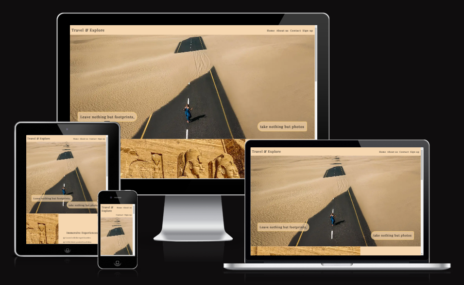
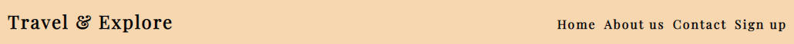
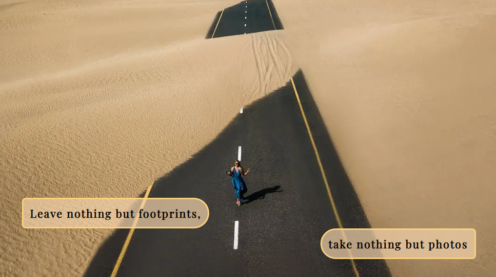
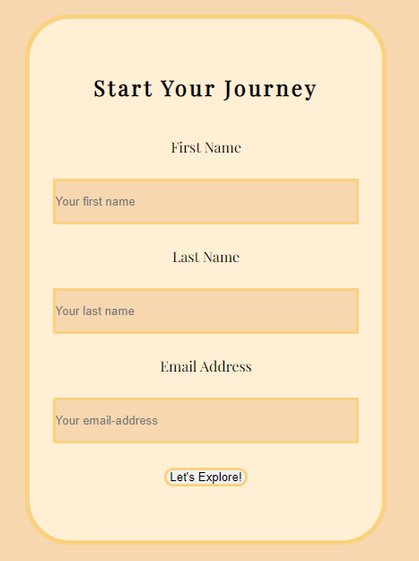
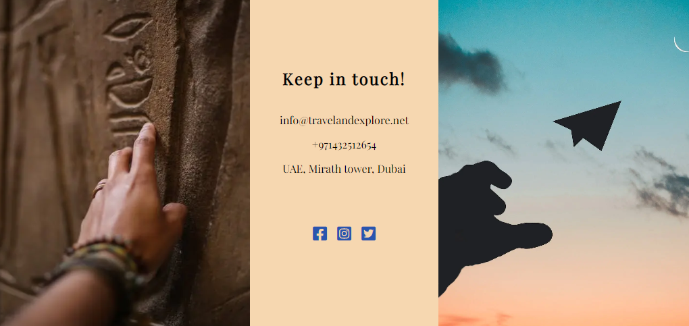
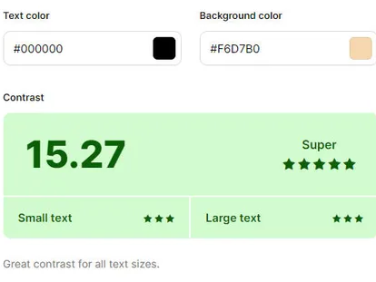
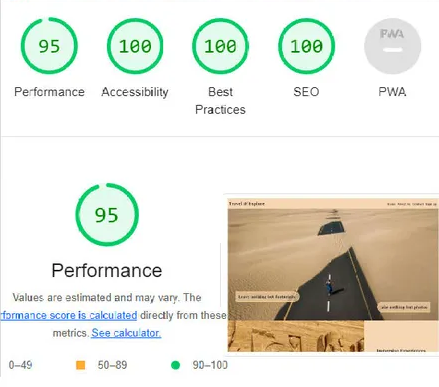

# Travel and Explore

Every journey comes with planning. Our mission here is to give user the chance to connect with our members, those who are expert travelers, to gain more news, tips, tricks, and passion that make user trip extraordinary.

Also, users can build their own albums by adding photos and sharing their inspiring stories and the moments from their traveling.

## Feature

### Existing Features

- __The header - Navigation bar__

  - Navigation bar is on the head of the page.
  
  - The logo is on the left side that links to the header.
  
  - Four navigation links (home, about us, contact and sign up) are to the right which link to different sections of the same page.
  
  - The header shows the name of website and help user to reach the different sections in the same page.
  
  - The links color changes when hover the mouse above it.
  

- __The home image section__

  - The home image includes a background image to give a good hint about the website.

  - Also it includes a text divided from each one by located differently inside the image to give a passion and inspiration for travelling.
  

- __About us Section__

  - This section describes in more details about the goal of the website.
  
  - One image on the left give an impact of the mysterious archaeological site.
  
  - Tow texts on the other side contains headline and paragraph each one, to explain the goals and why it's appropriate, in an organized listed way.
  
  - The image and the text aligning beside each other horizontally or vertically according to the size of the screen, to facilitate the exploring.

- __Join us section__

  - It contains a sign-up form to use the website services.
  
  - The form collects user's first name, last name and an email address.
  
  - Hint available when user is missing one of the filling or fill an incorrect email address form.
  
  - The font in submit button turns to bold when hover the mouse over it.

  

- __The Footer - contact us__

  - The footer section contains our contact information to reach us online or in real visiting without any hesitate, (email address, phone number and addres).
  
  - The contact information are in the middle of two images that illustrate how they are close to us.
  
  - Promote the user to be more social with us by providing our social media links, that listed beside each other and represented as an icons.
  

### Features need to Implement in the future

- Log in page for the users and other to the expert travelers.

- A page to connect the users with the expert travelers.

- A profile page for the users to build and share their albums and experiences from travelling.

## Testing

- The project works successfully in the major different browsers.

- I tasted the contrast by calculating the contrast ratio of text and background color using color contrast checker [coolors](https://coolors.co/contrast-checker/112a46-acc8e5).

- I tested the submit and the hint for required user information details in the sign up form.

- I tested the changing font color or font weight when hover the mouse over the nav-links and the submit button in sign up form.
  
- The project is tested and worked smoothly to different screen sizes. In this case the order of the image and the text in (head image, about us, and contact sections) will be switched horizontally or vertically according to the size of the screen to organize the context and facilitate the viewing, by adding flex as a a layout.

## unfixed-bugs

- I used [Replit](https://replit.com/) as a draft for my project. Then when the project was almost finished, I moved my source codes and files to codeanywhere.

- I faced many bugs, inconvenient notifications and heavy loading using codeanywhere.

- when I tried to log in at codeanywhere using my email address or github account it shows that Subscription expired. But instead, I used the link from Code institute.

### Validator Testing

- HTML
  - No errors were found when passing through the official W3C validator.
  
- CSS
  - No errors were found when passing through the official (Jigsaw) validator.

### accessibility

I tested using lighthouse.

## Deployment

- The site was deployed to GitHub pages. The steps to deploy are as follows:
  - In the GitHub repository, navigate to the Settings tab.
  - From the source section drop-down menu, select the Main Branch.
  - Once the main branch has been selected, the page provided the link to the completed website.

The live link can be found here - [Travel and Explore](https://ahmadalhindi.github.io/travel-and-explore/).

## Credits

### Content

- Instruction on how to use flexbox as a general was from [YouTube](https://www.youtube.com/), but most of codes were as self-practicing.

- The font was taken from [Google Fonts](https://fonts.google.com/).

### Media

- All images were taken from [Pexels](https://www.pexels.com/).
  
- The icons in the footer were taken from [Font Awesome](https://fontawesome.com/).